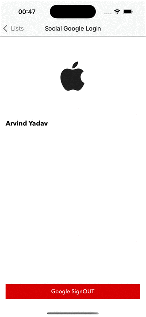

# PhoneVault
This iOS application is a feature-rich, MVVM-based mobile app built using Swift, Combine, and Core Data, designed to demonstrate real-world iOS development skills. It integrates Google Sign-In via Firebase, handles offline data persistence, provides push notifications, and supports rich media interactions like image capture, gallery selection, and PDF viewing.

## Objective

### 🔐 User Authentication
Implement Google Sign-In using Firebase Authentication to authenticate users. Save the user's details securely in Core Data for offline access and data persistence.

### 📄 PDF Report Viewer
This code uses WKWebView to display a PDF from a given URL. It includes functionalities like loading progress indication, error handling, and sharing options.

### 📸 Image Handling
This class enables users to capture images using the camera or select them from the photo gallery. The selected image is then displayed in a UIImageView.

### 💾 Core Data + API Integration
Fetch data from the specified API and store it in Core Data. Implement update, delete, error handling, and validation functionalities for the stored data.

### 🔔 Push Notifications (via FCM or Local Notification)
Simulate push notifications using a local .apns file to trigger deletion alerts. Upon confirmation, the item is removed from both the UI array and Core Data database.

## Key Features

- MVVM Architecture pattern
- Combine
- Designed for scalability
- Modular code

## Screenshots

<strong>List Screen</strong>

  

<strong>Google Sign IN</strong>

  

<strong>PDF Viewer</strong>

  

<strong>Image Gallery & Camera</strong>

  
  
  

<strong>Phone List (CoreData)</strong>

  

